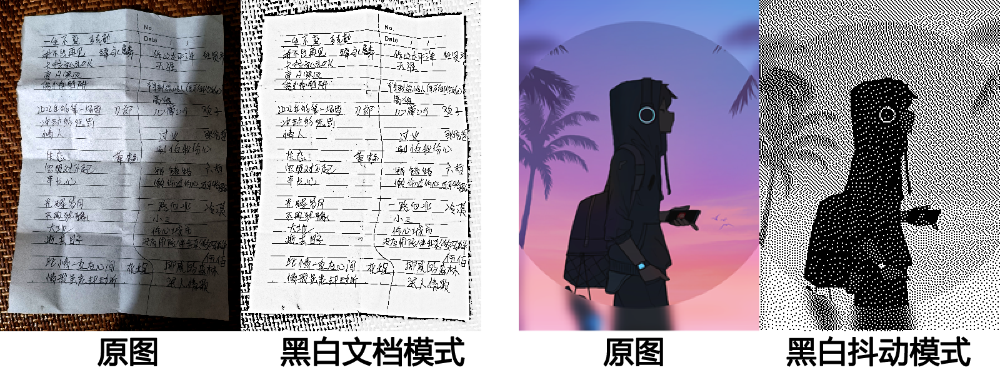

# 🌟 JarkViewer

    

[中文](README.md) | English

*An efficient and convenient multi-format image viewer*


## ✨ Controls

1.  **⏭ Switch**: `Click/Wheel` on left/right window edges / `Left/Right` Arrow Keys
2.  **🔍 Zoom**: Mouse wheel in window center / `Up/Down` Arrow Keys
3.  **🔄 Rotate**: `Click/Wheel` on top-left or top-right window corners / `Q/E` Keys
4.  **🖱️ Panning**: Mouse drag / `W/A/S/D` Keys
5.  **ℹ️ EXIF Info**: Click mouse wheel / `TAB` or `I` Key
6.  **🖥️ Fullscreen**: Double-click window / `F` Key / `F11` Key
7.  **📋 Copy Image**: `Ctrl + C`
8.  **🖨 Print**: `Click` on bottom-left window corner / `Ctrl + P`
9.  **🎞️ Browse Frames**: Use top control bar / `J: Previous Frame` `K: Pause/Resume` `L: Next Frame`
10. **⌨️ Space Key**: If viewing a static image, switches to next image. If viewing an animation, toggles pause/play.
11. **✂️ Split animation**: Press `Ctrl + S` to save each frame of the animation as a separate still image file.

---

## 🖨 Print/Edit

The print function allows simple adjustments to image `contrast`, `brightness`, `inversion`, etc., before deciding to **Save As** another image file or **Continue Printing**.

You can also select color modes: `Color`, `Gray`, `Document`, `Dithering`.

1.  **Document**: Balances overall brightness, highlights text, and avoids the visual impact of local shadows. Suitable for printing images of photographed text documents.
2.  **Dithering**: Simulates pixel grayscale values using the distribution density of pure black pixels. This mode is suitable for dot-matrix and thermal printers and can also produce good image results.



## 🗃️ Additional Features

1.  🍀 Fully static linking compilation, native portable single file
2.  ✅ Automatically remembers last window position/size
3.  🌗 Window automatically adapts to system dark/light theme
4.  ♟️ Chessboard background for image transparent areas
5.  📖 Supports reading metadata/prompts from AI-generated images (e.g., Stable-Diffusion, Flux, ComfyUI) 【*Provided the image contains such information; not all text-to-image outputs include it*】

🔧 If prompted about missing `MSVCP140.dll` etc. on startup, please download and install the VC++ runtime: [Microsoft Visual C++ 2015-2022 Redistributable (x64)](https://aka.ms/vs/17/release/vc_redist.x64.exe)

---

## 📂 Supported Image Formats

-   **Static**: `apng avif avifs bmp bpg dib exr gif hdr heic heif ico icon jfif jp2 jpe jpeg jpg jxl jxr livp pbm pfm pgm pic png pnm ppm psd pxm qoi ras sr svg tga tif tiff webp wp2`
-   **Animated**: `gif webp png apng jxl bpg avif`
-   **Live**: `livp (IOS LivePhoto) jpg/heic/heif (Android MicroVideo/MotionPhoto)` *Audio playback not supported yet*
-   **RAW**: `3fr ari arw bay cap cr2 cr3 crw dcr dcs dng drf eip erf fff gpr iiq k25 kdc mdc mef mos mrw nef nrw orf pef ptx r3d raf raw rw2 rwl rwz sr2 srf srw x3f`

---

## 🛠️ For Developers

When cloning the repository source code, only the latest commit is necessary as historical commits contain many space-consuming redundant files.
```sh
git clone git@github.com:jark006/JarkViewer.git --depth=1
```

This software is built with fully static linking. Developers need to prepare all third-party static library files before compilation. Please download the corresponding version of the third-party static library package from the link below and extract it to the specified location as instructed.

Static Library Download: [https://github.com/jark006/JarkViewer/releases/tag/static_lib](https://github.com/jark006/JarkViewer/releases/tag/static_lib)

With the exception of `OpenCV`, the static libraries above were copied from libraries installed via vcpkg. The OpenCV static library compilation baseline instruction set is AVX2, meaning it only supports `Intel 4th generation` / `AMD Ryzen series` and later CPUs. Besides removing unnecessary components like dnn/js/java/python bindings, the following main modifications were made:
1.  In source file `opencv-4.12.0\modules\imgcodecs\src\loadsave.cpp` lines #68-79, removed the image resolution limit.
2.  In source file `opencv-4.12.0\modules\highgui\src\window_w32.cpp` line #337, changed `IDC_CROSS` to `IDC_ARROW`, i.e., not using a crosshair cursor inside `cv::imshow()` windows.

If you prefer not to use the above static libraries, you can enable `vcpkg` support in the project properties and manually install the third-party libraries. (This list may not be updated promptly if new dependencies are added later; developers may need to install additional packages based on compilation error messages.)

```sh
vcpkg install x265:x64-windows-static
vcpkg install zlib:x64-windows-static
vcpkg install libyuv:x64-windows-static
vcpkg install exiv2[core,bmff,png,xmp]:x64-windows-static
vcpkg install libavif[core,aom,dav1d]:x64-windows-static
vcpkg install libjxl:x64-windows-static
vcpkg install libheif[core,hevc]:x64-windows-static
vcpkg install libraw[core,dng-lossy,openmp]:x64-windows-static
vcpkg install lunasvg:x64-windows-static
vcpkg install opencv4[core,contrib,freetype,ipp,jasper,jpeg,jpegxl,nonfree,openexr,opengl,openjpeg,png,tiff,webp,world]:x64-windows-static
```

---

## 📜 License

This project is open-sourced under the MIT License. For more details, see the [LICENSE file](https://github.com/jark006/JarkViewer/blob/main/LICENSE).